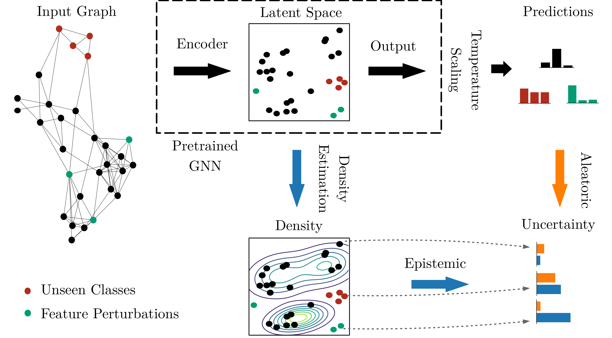

# Master Thesis: Uncertainty Estimation in Graph Neural Networks using Feature-based Density

This is the repository for the Master Thesis "Uncertainty Estimation in Graph Neural Networks using Feature-based Density". 

## General Information

**Title**: Uncertainty Estimation in Graph Neural Networks using Feature-based Density<br>
**Author**: Dominik Fuchsgruber<br>
**Supervisor**: Prof. Dr. Stephan Günnemann<br>
**Advisor(s)**: Tom Wollschläger, M.Sc.<br>

## Overview




The framework is applied to a pre-trained GNN classifier as follows: <br>

1. Compute node embeddings for all labeled instances (train, val)
2. For each class, fit a multivariate Gaussian to all corresponding embeddings as a density function
3. Fine-tune temperature scaling on validation nodes

Uncertainty is obtained for a new node:
- **Epistemic Uncertainty**: Evaluate the density function at the embedding of the new node
- **Aleatoric Uncertainty**: The maximum score outputted by the classifier

## Installation

Python dependencies for this code can be installed using the `requirements.txt` or directly from the conda environment:

```bash
conda env create -f conda.yaml
```

## Datasets

Raw datasets need to be placed at `data/raw/{dataset}.npz`. We do not provide them in this repository. For implementing own datasets, subclass `data.base.SingleGraphDataset` in `data/base.py`.

By default, we provide configurations for the following benchmark datasets in `config/`:
- CoraML+OS
- CoraML
- Citeseer
- PubMed
- Coauthor CS
- Coauthor Physics
- Amazon Photos
- Amazon Computers
- OGBN Arxiv

## Running Experiments

Experiments are run using the [Sacred](https://sacred.readthedocs.io/en/stable/index.html) library. Furthermore, metrics are logged on [WandB](https://wandb.ai/). To use the latter, a free account is needed. You also need to set up using WandB from Python code (refer to the docs for how to use a WandB logger).

Experiments are run by executing the `training_semi_supervised_node_classification.py` script. You can supply a configuration file for an experiment like:

```bash
python3 training_semi_supervised_node_classification.py with config.yaml
```

### SEML

The [SEML](https://github.com/TUM-DAML/seml) library was used to store results of experiments in a MongoDB database. All corresponding configuration files are found in `seml_experiments/`.

### Testing

While developing methods, the files `test_data.py`, `test_ensemble.py`, `test_parameterless.py` and `test.py` were used. These files run experiments without SEML. They can be used as inspiration.

### Model Saving

By default, trained models are stored in a registry that uses the MongoDB database associated with SEML (you need to install SEML to run this code). It associates each set of model weights with a configuration file. This way, models can be re-used and do not need to be re-trained multiple times. To select the collection used for the model registry, change the `run.model_registry_collection_name` attribute in the configuration of an experiment. To select the location to put model weights at change the `run.model_registry_directory` attribute.

### Dataset Registry

Dataset preprocressing and splitting is cached as well using a similar registry framework. The associated configuration attributes are `data.dataset_registry_collection_name` and `data.dataset_registry_directory`.

### Evaluation Pipeline

The evaluation of a model is done in a plug-and-play manner. You can compose your own pipeline to create various logs and compute metrics on different datasets. To that end, pipeline elements are listed in the `evaluation.pipeline` configuration attribute. Elements to use in the evaluation pipeline subclass from `evaluation.pipeline.base.PipelineMember`. Look into files for testing (see above) or seml experiments for examples of supported evaluation.

## Code Overview
We provide a short overview of the code structure:
- `training_semi_supervised_node_classification.py`: Main script to run experiments. Performs logging, issues model training and runs the evaluation pipeline.
- `train.py`: Performs model training.
- `configuration.py`: Defines configuration for an experiment.
- `data/`: All things data related.
  - `npz.py`: Dataset class for the supported npz-format datasets.
  - `split.py`: Performs dataset splitting.
- `model/`: All things model related.
  - `gnn.py`: Different GNN architectures.
  - `semi_supervised_node_classification.py`: A base-class for any model that performs semi-supervised node classification and provides uncertainty estimates.
  - `prediction.py`: Container class for attributes that are predicted by a model.
  - `density.py`: Density models for the latent space of a GNN.
- `evaluation/`: All things regarding the evaluation pipeline.
  - `uncertainty_quantification`: Provides functionality for evaluating uncertainty estimates in terms of out-of-distribution detection and misclassification detection including plotting.
  - `feature_space_density`: Pipeline element to fit a density model in the latent space of a GNN classifier (see framework overview above)
- `plot/`: All things related to plotting.

Furthermore, a set of extensive jupyter notebooks for evaluation is provded in `jupyter_notebooks`. Notebooks are categorized according to the following scheme:
- `data_nbs/`: Notebooks to investigate, verify and visualize datasets
- `evaluation_nbs/`: Notebooks to evaluate weekly experiments over the course of the thesis.
- `on_the_fly_nbs/`: Quick and dirty notebooks for minor things.
- `presentation_nbs/`: Notebooks for evaluation and plotting in terms of the midterm and final presentation.
- `thesis_nbs/`: Notebooks for evaluation and plotting in terms of the thesis itself.